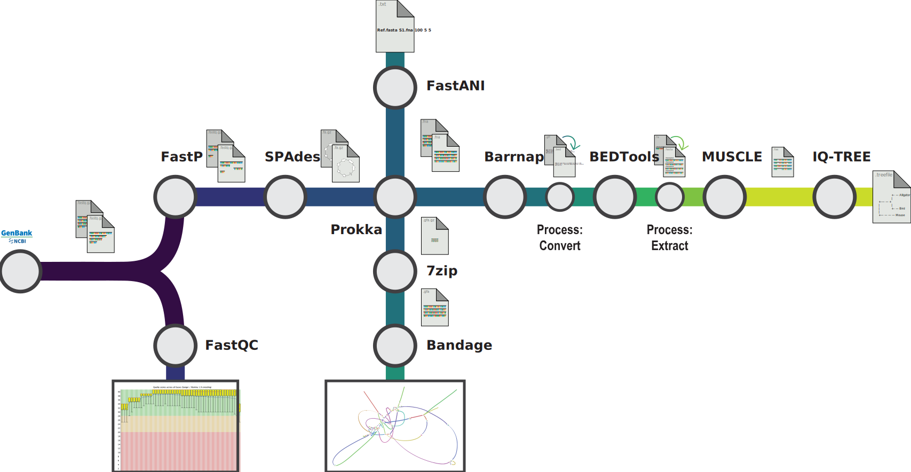

<h1> <code>Nextflow</code> Bactonomy </h1>


> A complete and well-integrated pipeline to clean, assemble, and analyze bacterial genomes using `Nextflow` and `nf-core`

- [Local Environment](https://github.com/yifan-grace-tang/nextflow-bactonomy/blob/main/README.md#local-environment)
- [Architecture](https://github.com/yifan-grace-tang/nextflow-bactonomy/blob/main/README.md#architecture)
- [Pre-Requisites](https://github.com/yifan-grace-tang/nextflow-bactonomy/blob/main/README.md#pre-requisites)
- [Getting Started](https://github.com/yifan-grace-tang/nextflow-bactonomy/blob/main/README.md#getting-started)

### Local Environment

- Name: Yifan (Grace) Tang
- GT Username: `ytang370`
- Package Manager: `Docker 28.0.4` `Conda 24.11.3`
OS architecture:
```shell
Darwin Graces-MacBook-Pro.local 24.3.0
Darwin Kernel Version 24.3.0:
Thu Jan  2 20:24:24 PST 2025;
root:xnu-11215.81.4~3/RELEASE_ARM64_T6030 arm6
```
### Architecture

<p align="center">
  
</p>

### Pre-Requisites

>[!NOTE]
> `Nextflow` requires `Bash 3.2` (or later) and `Java 17` (or later, up to `23`)

```shell
conda create -n bactonomy nextflow
```
```shell
conda activate bactonomy
```

In order to set-up a _minimal_ version of `Nextflow` and `nf-core` locally follow the steps listed in this [documentation](https://nf-co.re/docs/nf-core-tools/installation). The workflow detailed in this repository was tested using a dedicated `conda` environment __and__ with a `docker` environment.

### Getting Started

> These steps assume you have already clone this repository with `git clone https://github.com/yifan-grace-tang/nextflow-bactonomy`

1. Enter the working directory of the repository:
```shell
cd nextflow-bactonomy
```

3. Store your file directory information:
```shell
BASEDIR=$(pwd)
```

5. Now you can simply run the workflow with (assuming you have the `docker daemon` running else use `-profile conda`:

```shell
nextflow run main.nf \
  --input "./input/samplesheet.csv" \
  --outdir "./output" \
  -c nextflow.config \
  -profile docker \
  --fasta "$BASEDIR/input/SRR2838710.fasta" \
  -with-dag "./output/flowchart.svg" \
  -with-timeline
```

4. This will generate all outputs for each module (process) within the `output` directory:

- assembly `.svg` and `.png` files from `bandage` located in `outputs/bandage`

- comparison `.txt` files from `FastANI` located in `outputs/fastani`

- phylogenetic `.treefile` file from `IQ-TREE` located in `outputs/iqtree`

<br/>
NOTE: During executation the console will log the current status as will as metrics after all processes are complete:

```shell
executor >  local (53)
[82/139612] NFCORE_BACTONOMY:BACTONOMY:FASTQC (SRR2838701)                [100%] 5 of 5 ✔
[96/7d9aeb] NFCORE_BACTONOMY:BACTONOMY:FASTP (SRR2838715)                 [100%] 5 of 5 ✔
[7f/44794d] NFCORE_BACTONOMY:BACTONOMY:SPADES (SRR2838715)                [100%] 5 of 5 ✔
[97/7e4ec8] NFCORE_BACTONOMY:BACTONOMY:PROKKA (SRR2838715)                [100%] 5 of 5 ✔
[96/7c122f] NFCORE_BACTONOMY:BACTONOMY:UNZIP (SRR2838715.assembly.gfa.gz) [100%] 5 of 5 ✔
[5c/047468] NFCORE_BACTONOMY:BACTONOMY:BANDAGE_IMAGE (SRR2838715)         [100%] 5 of 5 ✔
[a9/90b3dd] NFCORE_BACTONOMY:BACTONOMY:FASTANI (SRR2838715)               [100%] 5 of 5 ✔
[ca/9afdf1] NFCORE_BACTONOMY:BACTONOMY:BARRNAP (SRR2838715)               [100%] 5 of 5 ✔
[eb/666b71] NFCORE_BACTONOMY:BACTONOMY:BARRNAP_TO_BED (5)                 [100%] 5 of 5 ✔
[fe/31bf78] NFCORE_BACTONOMY:BACTONOMY:BEDTOOLS_GETFASTA (SRR2838715)     [100%] 5 of 5 ✔
[f9/7da197] NFCORE_BACTONOMY:BACTONOMY:BED_TO_MUSCLE                      [100%] 1 of 1 ✔
[c7/a802f3] NFCORE_BACTONOMY:BACTONOMY:MUSCLE (bedtomuscle)               [100%] 1 of 1 ✔
[ef/50704e] NFCORE_BACTONOMY:BACTONOMY:IQTREE (bedtomuscle)               [100%] 1 of 1 ✔
-[nf-core/bactonomy] Pipeline completed successfully-
WARN: Task runtime metrics are not reported when using macOS without a container engine
WARN: Graphviz is required to render the execution DAG in the given format -- See http://www.graphviz.org for more info.
Completed at: 10-Apr-2025 22:48:39
Duration    : 19m 4s
CPU hours   : 3.7
Succeeded   : 53
```
